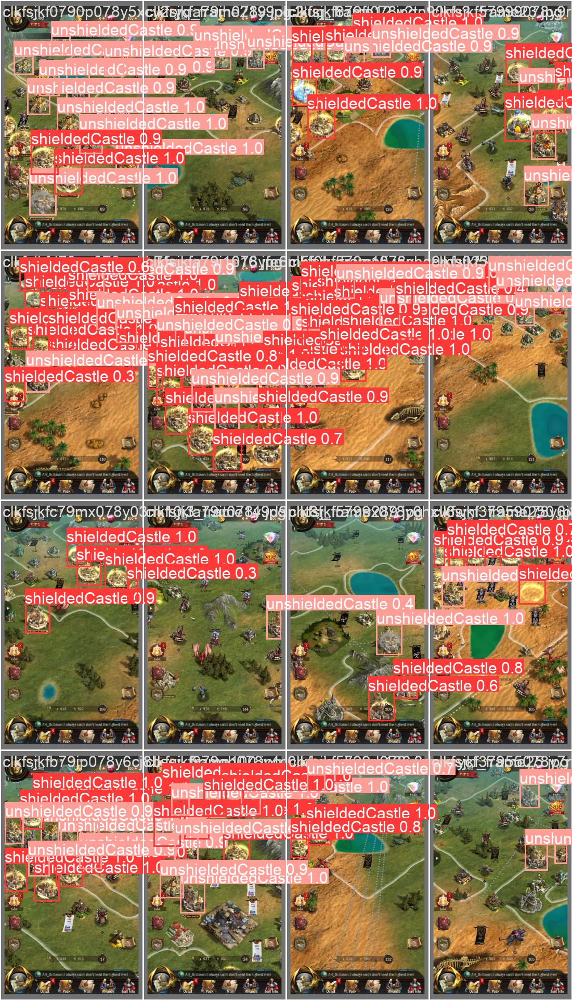

# YOLO-ShieldObjectDetection
Detects shielded cities using a custom YOLO object detection model

# For those interested in labelbox API integration:
See rawdata_to_labelproject.py for uploading images and labels to labelbox. See labelproject_to_trainingdata.py for converting the export ndjson from labelbox to yolo format.